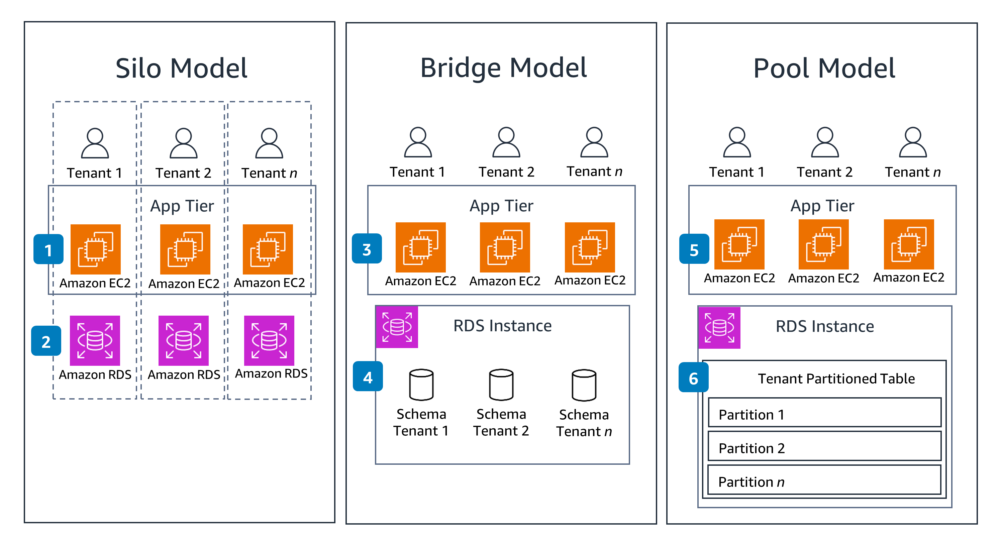

# Multi-Tenant Architectures

[Detail](https://d1.awsstatic.com/solutions/guidance/architecture-diagrams/multi-tenant-architectures-on-aws.pdf)

### Three approaches for designing multi-tenant SaaS models with Amazon Relational Database Service.

* **Silo Model**: Each tenant is given a dedicated application stack, providing the strictest isolation.
* **Bridge Model**: Tenants share the application stack, but get their  dedicated database schema.
* **Pool Model**: All resources are shared and isolation is provided by database row-level security.

### Silo Model

Each tenant interacts with an entire application dedicated to that tenant.
* The application stack runs on **Amazon Elastic Compute Cloud (Amazon EC2)** compute instances.
* Traffic and data do not cross tenant boundaries.

Each tenant's data is stored in an **Amazon Relational Database Service (Amazone RDS)** database instance dedicated to that tenant.
* A tenant's data does not mix with other tenants' data.

### Bridge Model

* Tenants share the complete application stack, reducing cost and complexity.

* Tenants share the same **RDS** instance, but each have a dedicated schema.

### Pool Model

* Tenants share the entire application stack, just as in the Bridge Model.

* Tenants share the same database instance and objects.
  * Database tables contain data for multiple tenants.
  * Tenant isolation is provided by row-level security features in th database.
